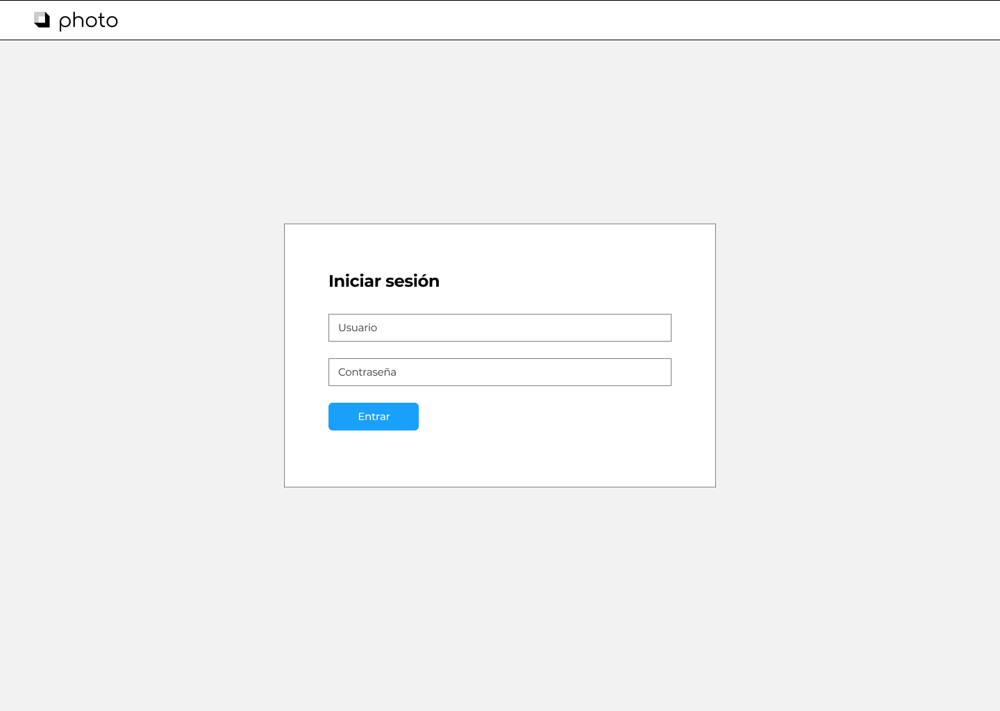
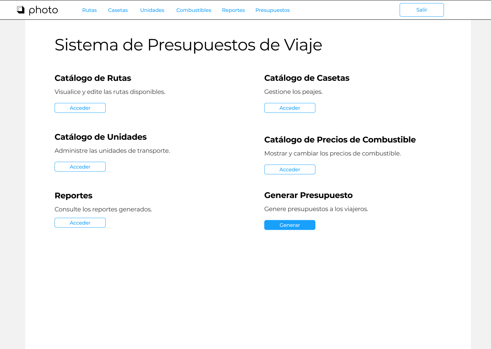
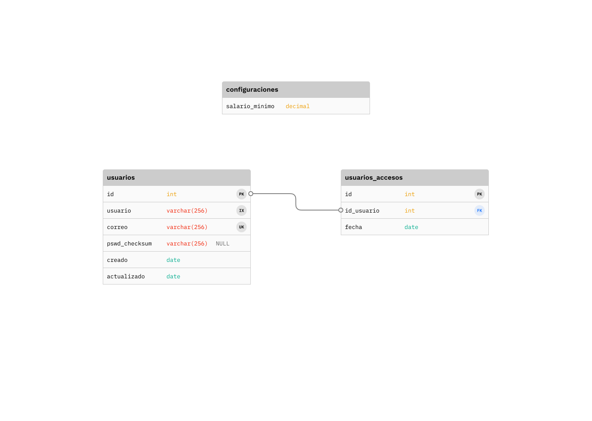
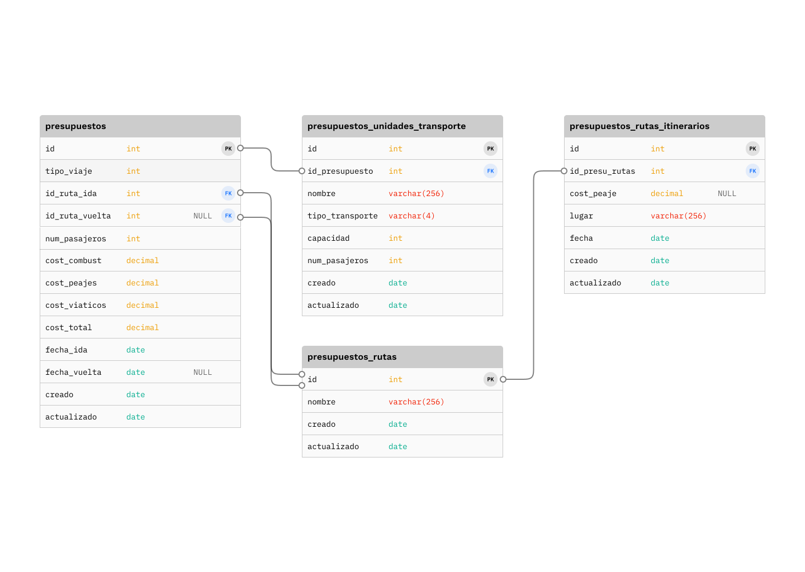
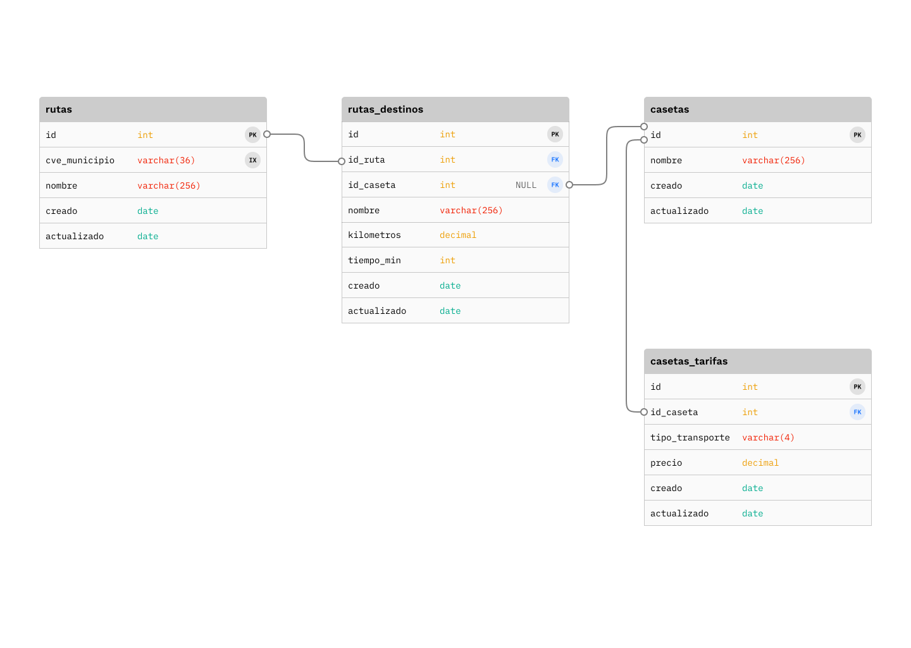

### Certuit Prueba Técnica

Repositorio de la prueba técnica de Certuit de Sergio Contreras.

#### Planeación

En la siguiente tabla se muestran las actividades, tiempo estimado y utilizado en horas.

| Actividad                            | Tiempo estimado (hrs) | Tiempo utilizado (hrs) |
| ------------------------------------ | --------------------- | ---------------------- |
| Lectura y comprensión del documento. | 2.5                   | 3                      |
| Diseñar las pantallas.               | 4                     | 6.5                    |
| Diseñar esquema de base de datos.    | 5                     | 4.5                    |
| Diseñar api rest.                    | 2                     | 3                      |
| Preparar base de datos para pruebas. | 5                     | 5                      |
| Preparar entorno de desarrollo.      | 2                     |                        |


#### Lectura y comprensión del documento.

El objetivo del sistema es generar presupuestos de viajes, la especificación de caso de uso describe un sistema de un solo actor, el Administrador. Este debe autenticarse por usuario y contraseña en un formulario de inicio de sesión, ya dentro, se le mostrarán las opciones de catálogos de rutas, casetas, unidades, precios de combustible, generación de presupuesto y reportes.

En el flujo, el actor debe ingresar a la opción generar presupuesto, en el cual se le muestra la información de tipo de viaje, ruta de ida, ruta de regreso, fecha y horas de partida y regreso (si aplica). En base a las rutas capturadas, el sistema indicará los precios de las casetas por cada ruta, después se le solicita al actor capturar la cantidad de pasajeros, luego se habilita la opción de seleccionar transporte, cada unidad tiene una capacidad limitada de viajeros, por lo que se permite seleccionar tantas unidades hasta que no quede ninguno fuera.

Una vez completado el formulario, el sistema hace los cálculos de acuerdo a las reglas de negocio, genera la vista previa que incluye los datos generales de viaje, itinerario, costos de combustible, peajes, viáticos y costo total.

#### Diseñar las pantallas (mockups).

Para tener una visión mas clara del sistema, el siguiente paso es maquetar, para esto se utilizo la app de [Figma](https://www.figma.com) y el editable se puede [descargar aquí](mockups/editable.fig).

A continuación se muestran las pantallas y su descripción.

**Login:** El actor ingresa usuario y contraseña para autentificarse en el sistema.



**Login Fallido:** Sí la autenticación falla, se le muestra que el usuario y contraseña son inválidos.


**Dashboard:** Es la pantalla donde se redirige al usuario después de un login exitoso.



Los viajes pueden ser de una dirección o redondos, se crearon dos pantallas para estas situaciones.

**Generar Presupuesto de una Dirección:** Captura los datos de la ruta de ida.


**Generar Presupuesto de Viaje Redondo:** Captura los datos de las rutas de ida y vuelta.


**Resumen de Rutas de Viaje Redondo:** Muestra un resumen de las rutas de ida y vuelta, casetas y sus precios (sí aplica).


**Resumen de Rutas Expandido:** Desglosa los precios de los peajes para las distintas unidades de transporte.


**Capturar Número de Pasajeros:** Ingresa el número de pasajeros del viaje.


**Seleccionar Transporte:** Permite indicar que unidades de transporte del catálogo se van a utilizar para el viaje.


**Seleccionar Transporte Completado:** Ejemplifica las unidades asignadas a un viaje sin que nadie se quede fuera.


**Vista Previa Presupuesto:** Presenta los datos del presupuesto de viaje completados y lo guarda.


#### Diseñar esquema de base de datos.

El esquema define la forma lógica en la que almacena la información del sistema, a continuación se muestran las relaciones de las tablas y su descripción. También se ha utilizado [Figma](https://www.figma.com) y el editable se puede [descargar aquí](db_schema/editable.fig).

**Catálogo de Usuarios:** Almacena los usuarios del sistema, el historial de accesos y hay una tabla adicional de configuraciones para definir el salario mínimo.



**Presupuestos:** Historial de presupuestos generados, contiene el tipo de viaje, las rutas, número de pasajeros, costos, y las fechas de ida y vuelta, unidades de transporte utilizadas y el itinerario.



**Catálogo de Rutas:** Son las rutas disponibles para los presupuestos de viaje, se pueden filtrar por municipio y tiene un nombre. Están relacionados a sus destinos que tienen nombre, kilómetros, tiempo en minutos. Los destinos pueden o no tener casetas, estas tienen un nombre y tarifas para cada tipo de transporte, el valor del tipo de transporte es el mismo que maneja la página de traza tu ruta http://app.sct.gob.mx/sibuac_internet/ControllerUI?action=cmdEscogeRuta.



**Catálogo de Unidades de Transporte:** Vehículos designados para el transporte de viajeros, sus datos incluyen su nombre, placas, tipo de transporte, tipo de combustible y la capacidad de pasajeros. Estos últimos están relacionados a la tabla de combustibles, la cual contiene su nombre y el precio por litro, el valor del tipo de transporte es el mismo que maneja la página de traza tu ruta http://app.sct.gob.mx/sibuac_internet/ControllerUI?action=cmdEscogeRuta.


#### Diseñar api rest.

Api rest es la interfaz de comunicación entre frontend y backend, a continuación se detallan las rutas de la api.

**Login:** Recibe el usuario y contraseña y lo compara con la base de datos, si todo está correcto retorna 200, de lo contrario 400.

POST /api/presupuestos/v1/public/login

Ejemplo request

```json
{
    "usuario": "sergio",
    "password": "a1b2c3"
}
```

Ejemplo response exitoso (200).

```json
{
    "usuario": "sergio",
    "token": "d546sd5fsd546e81v68s1rf6"
}
```

Ejemplo response fallido (400).

```json
{
    "error": "usuario y contraseña inválidos"
}
```

**Listar rutas:** Muestra las rutas de viaje disponibles en el sistema, se pueden filtrar por clave de municipio con la ayuda de la api rest de http://proveedores.col.gob.mx.

Requiere autenticación con el header x-Token.

GET /api/presupuestos/v1/rutas

Parámetros query string:

- cve_municipio: clave de municipio proporcionada por la api rest de http://proveedores.col.gob.mx

Ejemplo request sin filtro de municipio.

GET /api/presupuestos/v1/rutas

Ejemplo response exitoso

```json
[
    {
        "id_ruta": 48,
        "cve_municipio": "54FA9CC4-D993-442E-BCE2-443396B6C838",
        "nombre": "Mexicali, Tecate"
    },
    {
        "id_ruta": 49,
        "cve_municipio": "C3C2196E-1DFF-48C5-BE9F-35FAF00D6801",
        "nombre": "Mexicali, Tijuana"
    },
    {
        "id_ruta": 50,
        "cve_municipio": "E702D7AD-7F85-43C3-A9BC-FB774B036843",
        "nombre": "Mexicali, San Luis Rio Colorado"
    }
]
```

Ejemplo request con filtro de municipio.

GET /api/presupuestos/v1/rutas?cve_municipio=C3C2196E-1DFF-48C5-BE9F-35FAF00D6801

Ejemplo response exitoso

```json
[
    {
        "id_ruta": 48,
        "cve_municipio": "54FA9CC4-D993-442E-BCE2-443396B6C838",
        "nombre": "Mexicali, Tecate"
    },
    {
        "id_ruta": 49,
        "cve_municipio": "C3C2196E-1DFF-48C5-BE9F-35FAF00D6801",
        "nombre": "Mexicali, Tijuana"
    }
]
```

Ejemplo request con filtro de municipio sin resultados.

GET /api/presupuestos/v1/rutas?cve_municipio=10C1B84E-E20D-47F1-A705-119BB59EF331

Ejemplo response exitoso

```json
[]
```

**Detalle de ruta:** Muestra el detalle de una ruta lo cual incluye: destinos, distancias, tiempos y precios de casetas (sí aplica).

Requiere autenticación con el header x-Token.

GET /api/presupuestos/v1/rutas/{id_ruta}

Ejemplo request de una ruta que si existe.

GET /api/presupuestos/v1/rutas/48

Respuesta exitosa (200).

```json
{
    "id_ruta": 48,
    "cve_municipio": "54FA9CC4-D993-442E-BCE2-443396B6C838",
    "nombre": "Mexicali, Tecate",
    "kilometros": 129.750,
    "tiempo": 93,
    "destinos": [
        {
            "id_ruta_destino": 101,
            "id_ruta": 48,
            "id_caseta": null,
            "nombre": "Mexicali - Flor del Desierto",
            "kilometros": 48.271,
            "tiempo_min": 38,
            "caseta": null
        },
        {
            "id_ruta_destino": 102,
            "id_ruta": 48,
            "id_caseta": 201,
            "nombre": "Flor del Desierto - Entronque La Rumorosa",
            "kilometros": 20.841,
            "tiempo_min": 17,
            "caseta": {
                "id_caseta": 201,
                "nombre": "La Rumorosa",
                "tarifas": [
                    {
                        "id_caseta_tarifa": 301,
                        "id_caseta": 201,
                        "tipo_transporte": "1",
                        "precio": 12.0
                    },
                    {
                        "id_caseta_tarifa": 302,
                        "id_caseta": 201,
                        "tipo_transporte": "10",
                        "precio": 113.0
                    },
                    {
                        "id_caseta_tarifa": 303,
                        "id_caseta": 201,
                        "tipo_transporte": "11",
                        "precio": 113.0
                    }
                ]
            }
        },
        {
            "id_ruta_destino": 103,
            "id_ruta": 48,
            "id_caseta": 202,
            "nombre": "Entronque La Rumorosa - Libramiento de Tecate (Ent. Sandoval)",
            "kilometros": 55.336,
            "tiempo_min": 30,
            "caseta": {
                "id_caseta": 202,
                "nombre": "El Hongo",
                "tarifas": [
                    {
                        "id_caseta_tarifa": 317,
                        "id_caseta": 202,
                        "tipo_transporte": "1",
                        "precio": 43.0
                    },
                    {
                        "id_caseta_tarifa": 318,
                        "id_caseta": 202,
                        "tipo_transporte": "10",
                        "precio": 158.0
                    },
                    {
                        "id_caseta_tarifa": 319,
                        "id_caseta": 202,
                        "tipo_transporte": "11",
                        "precio": 280.0
                    }
                ]
            }
        },
        {
            "id_ruta_destino": 104,
            "id_ruta": 48,
            "id_caseta": null,
            "nombre": "Libramiento de Tecate (Ent. Sandoval) - Tecate",
            "kilometros": 5.302,
            "tiempo_min": 6,
            "caseta": null
        },
    ]
}
```

**Listar unidades de transporte:** Lista los vehículos disponibles para trasladar a los viajeros.

Requiere autenticación con el header x-Token.

GET /api/presupuestos/v1/unidades

Ejemplo response exitoso

```json
[
    {
        "id_unidad_transporte": 501,
        "id_combustible": 601,
        "nombre": "Autobús verde",
        "placas": "ASDF",
        "tipo_transporte": "6",
        "cap_pasajeros": 40
    },
    {
        "id_unidad_transporte": 502,
        "id_combustible": 601,
        "nombre": "Autobús Rojo",
        "placas": "ASDF",
        "tipo_transporte": "6",
        "cap_pasajeros": 40
    },
    {
        "id_unidad_transporte": 503,
        "id_combustible": 601,
        "nombre": "Autobús Negro",
        "placas": "ASDF",
        "tipo_transporte": "8",
        "cap_pasajeros": 40
    },
]
```

**Vista previa y calcular presupuesto de viaje:** Genera vista previa o guarda el presupuesto de viaje de acuerdo al parámetro de tipo.

Requiere autenticación con el header x-Token.

Parámetros query string:

- tipo: "previo" para generar vista previa sin guardar, "guardar" para grabar en base de datos.

POST /api/presupuestos/v1/presupuestos

Ejemplo de vista previa

POST /api/presupuestos/v1/presupuestos?tipo=previo

```json
{
    "tipo_viaje": 1,
    "id_ruta_ida": 48,
    "id_ruta_vuelta": null,
    "num_pasajeros": 300,
    "fecha_ida": "2021-08-17 06:00:00",
    "fecha_vuelta": null,
    "ids_unidades_transporte": [501, 502, 503]
}
```

Ejemplo response exitoso (200).

```json
{
    "id_presupuesto": null,
    "tipo_viaje": 1,
    "id_ruta_ida": null,
    "ruta_ida": {
        "id_presupuesto_ruta": null,
        "nombre": "Mexicali, Tecate",
        "itinerario": [
            {
                "id_presupuesto_ruta_itinerario": null,
                "id_presupuesto_ruta": null,
                "cost_peaje": null,
                "fecha": "2021-08-17 06:00:00"
            },
            {
                "id_presupuesto_ruta_itinerario": null,
                "id_presupuesto_ruta": null,
                "cost_peaje": 3000.0,
                "fecha": "2021-08-17 06:40:00"
            },
            {
                "id_presupuesto_ruta_itinerario": null,
                "id_presupuesto_ruta": null,
                "cost_peaje": null,
                "fecha": "2021-08-17 07:20:00"
            }
        ]
    },
    "id_ruta_vuelta": null,
    "ruta_vuelta": null,
    "num_pasajeros": 300,
    "fecha_ida": "2021-08-17 06:00:00",
    "fecha_vuelta": null,
    "costo_combustible": 9916.0,
    "costo_peajes": 9916.0,
    "costo_viaticos": 12803.4,
    "costo_total": 25539.4,
    "unidades_transporte": [
        {
            "id_unidad_transporte": null,
            "nombre": "Autobús Verde",
            "tipo_transporte": "6",
            "capacidad": 40,
            "num_pasajeros": 40,
        },
        {
            "id_unidad_transporte": null,
            "nombre": "Autobús Negro",
            "tipo_transporte": "8",
            "capacidad": 40,
            "num_pasajeros": 40,
        }
    ]
}
```

Ejemplo de guardado

POST /api/presupuestos/v1/presupuestos?tipo=guardar

```json
{
    "tipo_viaje": 1,
    "id_ruta_ida": 48,
    "id_ruta_vuelta": null,
    "num_pasajeros": 300,
    "fecha_ida": "2021-08-17 06:00:00",
    "fecha_vuelta": null,
    "ids_unidades_transporte": [501, 502, 503]
}
```

Ejemplo response exitoso (200).

```json
{
    "id_presupuesto": 701,
    "tipo_viaje": 1,
    "id_ruta_ida": 081,
    "ruta_ida": {
        "id_presupuesto_ruta": 901,
        "nombre": "Mexicali, Tecate",
        "itinerario": [
            {
                "id_presupuesto_ruta_itinerario": 1001,
                "id_presupuesto_ruta": 901,
                "cost_peaje": null,
                "fecha": "2021-08-17 06:00:00"
            },
            {
                "id_presupuesto_ruta_itinerario": 1002,
                "id_presupuesto_ruta": 901,
                "cost_peaje": 3000.0,
                "fecha": "2021-08-17 06:40:00"
            },
            {
                "id_presupuesto_ruta_itinerario": 1002,
                "id_presupuesto_ruta": 901,
                "cost_peaje": null,
                "fecha": "2021-08-17 07:20:00"
            }
        ]
    },
    "id_ruta_vuelta": null,
    "ruta_vuelta": null,
    "num_pasajeros": 300,
    "fecha_ida": "2021-08-17 06:00:00",
    "fecha_vuelta": null,
    "costo_combustible": 9916.0,
    "costo_peajes": 9916.0,
    "costo_viaticos": 12803.4,
    "costo_total": 25539.4,
    "unidades_transporte": [
        {
            "id_unidad_transporte": 1101,
            "nombre": "Autobús Verde",
            "tipo_transporte": "6",
            "capacidad": 40,
            "num_pasajeros": 40,
        },
        {
            "id_unidad_transporte": 1102,
            "nombre": "Autobús Negro",
            "tipo_transporte": "8",
            "capacidad": 40,
            "num_pasajeros": 40,
        }
    ]
}
```
